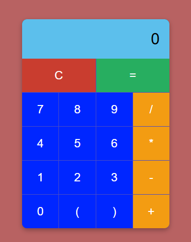

# Hesap Makinesi Projesi

Bu proje, temel aritmetik işlemleri gerçekleştirebilen basit bir hesap makinesi uygulamasıdır. 
Amacım, bu tür projeler üzerinde çalışarak kendimi geliştirmektir. Kullanıcı dostu bir arayüze sahip olan bu hesap makinesi, 
kullanıcıların toplama, çıkarma, çarpma, bölme gibi işlemleri gerçekleştirmesini sağlar. 
Ayrıca, parantez kullanımıyla daha karmaşık matematiksel işlemler yapılmasına olanak tanır.



## Özellikler

- **Temel İşlemler:** Toplama (+), çıkarma (-), çarpma (*), bölme (/) işlemlerini yapabilir.
- **Parantez Desteği:** Kullanıcılar, işlemlerini düzenlemek için açma `(` ve kapama `)` parantezleri kullanabilirler.
- **Temizleme Butonu:** `C` butonu ile hesap makinesi ekranı temizlenebilir.
- **Kullanıcı Dostu Arayüz:** Basit ve anlaşılır bir arayüze sahiptir.
- **Responsive Tasarım:** Farklı cihazlarda (mobil, tablet, masaüstü) uygun şekilde görüntülenir.

## Teknolojiler

Bu proje aşağıdaki teknolojiler kullanılarak geliştirilmiştir:

- **HTML:** Uygulamanın yapısını oluşturmak için.
- **CSS:** Uygulamanın görsel tasarımını yapmak için.
- **JavaScript:** Hesap makinesinin işlevselliğini sağlamak için.

## Kurulum

Bu projeyi yerel makinenizde çalıştırmak için aşağıdaki adımları takip edin:

1. **Repository'yi Klonlayın:**
   ```bash
   git clone https://github.com/diyaryaman/Hesap-Makinesi.git
2. **Proje Klasörüne Girin:**
    ```bash
   cd HesapMakinesi

3. **HTML Dosyasını Açın: index.html dosyasını tarayıcınızda açarak uygulamayı çalıştırabilirsiniz.**
Kullanım
1. Hesap makinesi açıldığında, ekranın üst kısmında işlem sonuçlarını göreceksiniz.
2. Sayıları ve işlemleri eklemek için ilgili butonlara tıklayın.
3. İşlemleri tamamladıktan sonra = butonuna basarak sonucu görün.
4. Hesap makinesi ekranını temizlemek için C butonuna tıklayın.
5. Parantez kullanarak karmaşık işlemler yapabilirsiniz; açma parantezine tıkladıktan sonra tekrar tıklamanız engellenir ve kapama parantezine tıkladıktan sonra tekrar tıklamanız da engellenir.

**Lisans**
Bu proje MIT lisansı altında lisanslanmıştır. Daha fazla bilgi için LICENSE dosyasını inceleyebilirsiniz.

**İletişim**
Herhangi bir sorun veya öneri için bana ulaşabilirsiniz:

E-posta: diyaryamanbey+git@gmail.com

GitHub: diyaryaman

Hesap Makinesi Projesi ile ilgili daha fazla bilgi edinmek için yukarıdaki yönergeleri takip edebilirsiniz.
 Umarım uygulamayı beğenirsiniz!